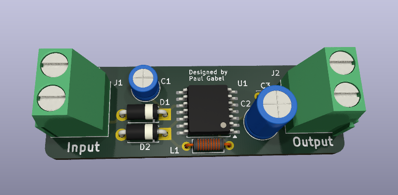
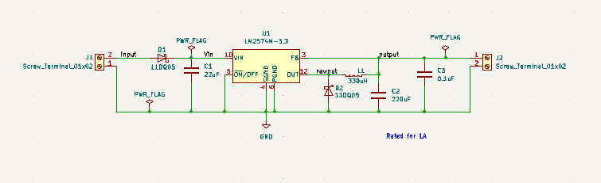
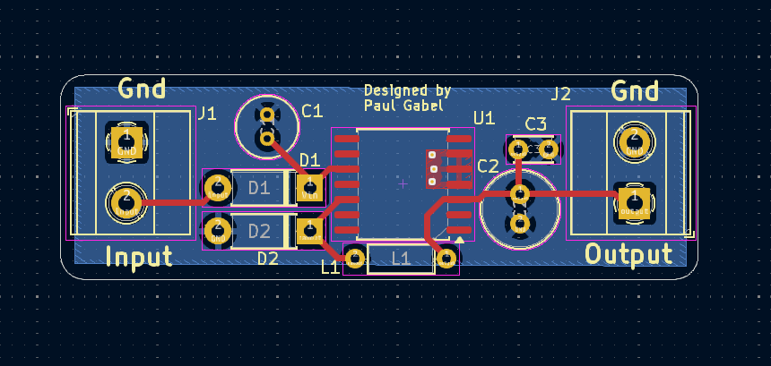

# 3.3v Buck Converter Board

This board uses a buck converter to output regulated 3.3v from a 4s LiPo battery. It has been used to successfully power an Arduino Microcontroller.

## Schematic

## Routing

Since the board is only designed to handle 1A, .5mm traces were used. This makes soldering easier.
